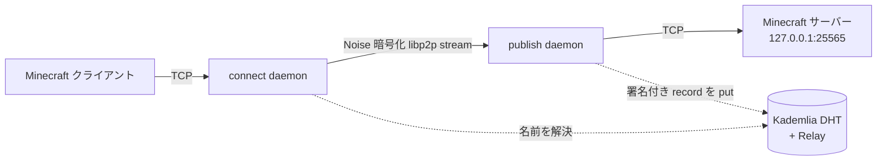

<div align="center">

# dotminecraft

### `xxxx.minecraft` 自己証明アドレスで Minecraft サーバーを公開・接続する

[](Cargo.toml)
[](mod)
[](crates/net)
[](LICENSE)

**中央レジストリも DNS もポート開放もグローバル IP も要らない。名前そのものが鍵への暗号的コミットメントなので、なりすませず・登録所も要らない。**

*(English: [README_en.md](README_en.md))*

---

</div>

## 概要

Minecraft Java 版サーバーを `survival.k7f3….minecraft` のような **自己証明アドレス**で外部公開し、相手はその名前だけで接続できます。設計思想は **Tor onion service v3 と同型** — アドレスは公開鍵のハッシュから導出される「指紋」なので、

- **名前の一意性**を中央の登録所なしで暗号的に保証する
- **他人がなりすます・名前を奪う**ことができない（鍵を持つ者だけがその名前を名乗れる）
- **ポート開放・固定 IP・DNS 登録が一切不要**（NAT の内側同士でも繋がる）

コマンドラインツール本体の名前は `mc-tunnel`、付属の Fabric MOD を入れれば**バニラに近い操作**で `.minecraft` アドレスに参加できます。

## 特徴

| 機能 | 内容 |
|------|------|
| 自己証明名 | `keyid = base32(SHA-256(pubkey))[:N]`（既定26文字＝130bit、最大52文字）。Tor と同じ a-z2-7 文字集合 |
| なりすまし不可 | 署名付き DHT レコードを `署名 → keyid↔pubkey 束縛 → 鮮度` の順で検証。改竄・上書き・リプレイを拒否 |
| 中央依存なし | Kademlia DHT で名前を解決。bootstrap/relay ノードは特権なしの普通の libp2p ノード |
| NAT 越え | AutoNAT + Circuit Relay v2 + DCUtR（hole punching）。LAN は mDNS で設定ゼロ |
| 暗号化トンネル | TCP ⇄ libp2p stream の全二重プロキシ（Noise 暗号化・yamux 多重化） |
| 自己完結 MOD | jar を 1 個入れるだけ。MC 起動時にデーモンを裏で自動起動（Tor Browser 方式） |
| リアルタイム ping | MOD の HUD に**約1秒更新**のトンネル実遅延を表示 |
| セキュア既定 | ローカルバインド既定・OS キーストア保存・`#![forbid(unsafe_code)]`・レート制限 |

## 処理フロー



両端とも**同じバイナリ**を別モードで動かすだけ。サーバー本体はループバック限定でネットに晒さず、トンネル経由でのみ到達できます。

## インストール

```bash
git clone https://github.com/cUDGk/dotminecraft
cd dotminecraft
cargo build --release        # 本体は target/release/mc-tunnel
```

Fabric MOD（任意・MC 1.21.x クライアント用）:

```bash
cd mod
./gradlew build              # build/libs/mc-tunnel-mod-0.1.0.jar
```

## 使い方

**サーバー側**（MC サーバーを `127.0.0.1:25565` で起動済みとして）:

```bash
mc-tunnel init                              # 鍵を生成
mc-tunnel name                              # 自分のアドレスを表示（相手に渡す）
mc-tunnel publish --target 127.0.0.1:25565  # サーバーを晒す（常駐）
```

**利用者側**（CLI で繋ぐ場合）:

```bash
mc-tunnel init
mc-tunnel connect survival.k7f3….minecraft --listen 127.0.0.1:25566
```

あとは Minecraft で `127.0.0.1:25566` をサーバー追加して参加します。

**Fabric MOD なら**: `mc-tunnel-mod-0.1.0.jar` を `.minecraft/mods/` に入れて MC を起動し、サーバーリストに `survival.k7f3….minecraft` を直接打つだけ（MOD が裏でデーモンを起動します）。

> 同一 LAN は mDNS で自動。インターネット越しは `mc-tunnel relay` で中継ノードを1台立て、両者の `config.toml` の `[network] bootstrap` に記載します。詳細な脅威モデルは [SECURITY.md](SECURITY.md)、全仕様は [SPEC.md](SPEC.md) を参照。

## サブコマンド早見表

| コマンド | 用途 |
|---|---|
| `init` / `name` / `forget` | 鍵の生成・アドレス表示・削除 |
| `publish` | サーバーをトンネルに晒す |
| `connect <名前>` | 名前を解決してローカルポートを開く |
| `relay` | 公開リレー兼 bootstrap ノードを立てる |
| `agent` | Fabric MOD 用のローカル制御エンドポイント |
| `doctor` | 疎通診断（listen addr / NAT / peer 数） |

## 注意（Tor onion と同じ性質）

- **匿名性は保証しません。** relay 経由で所在は多少隠れる程度で、Tor 級ではありません。
- 名前を知っていて到達できる相手はトンネルで繋げます（名前がアクセス鍵）。アクセス制限はサーバー側のホワイトリスト等で行ってください。
- 対象は **TCP / Java Edition のみ**（Bedrock の UDP は対象外）。

## ライセンス

MIT — [LICENSE](LICENSE) を参照。
